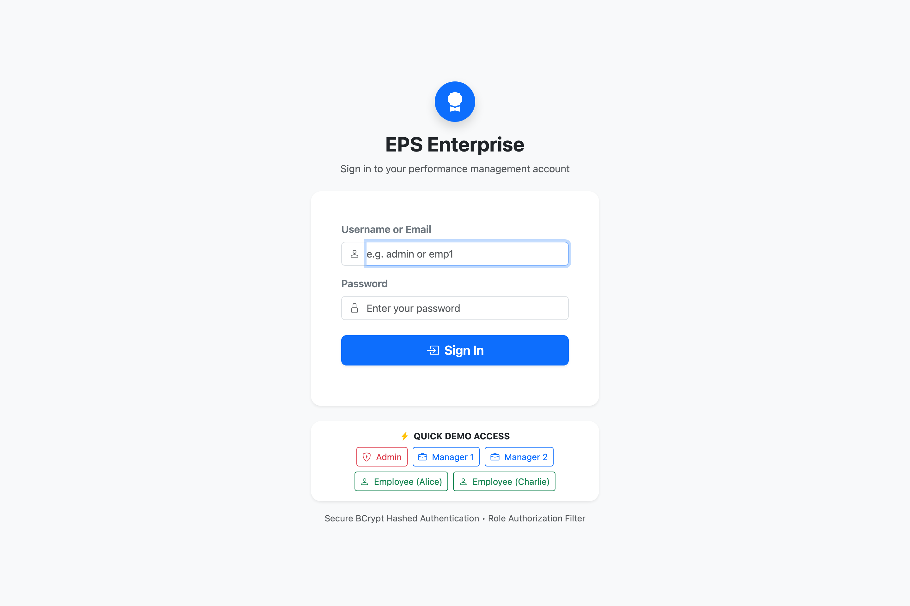
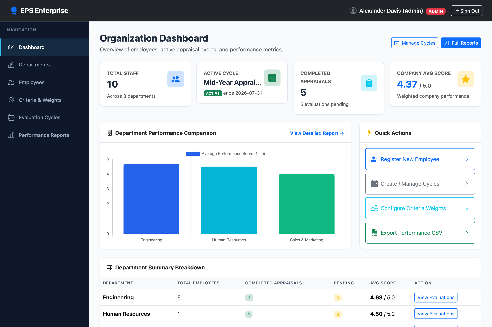
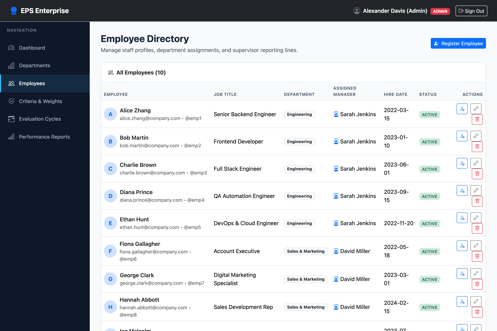
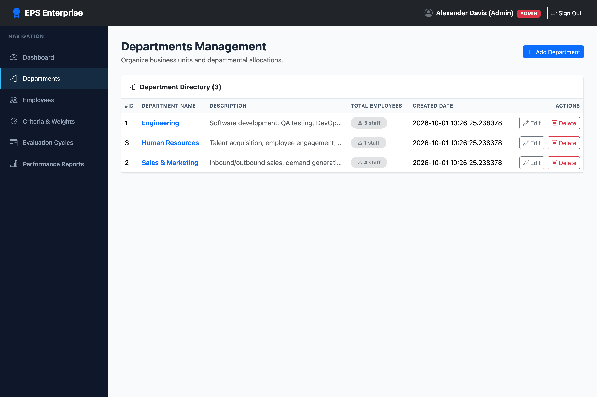
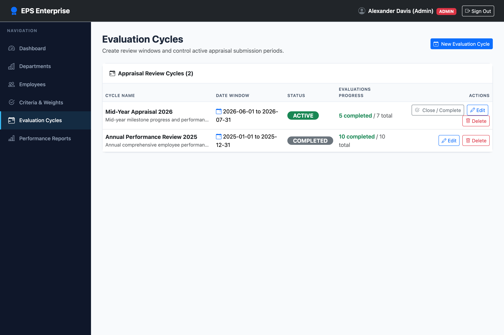
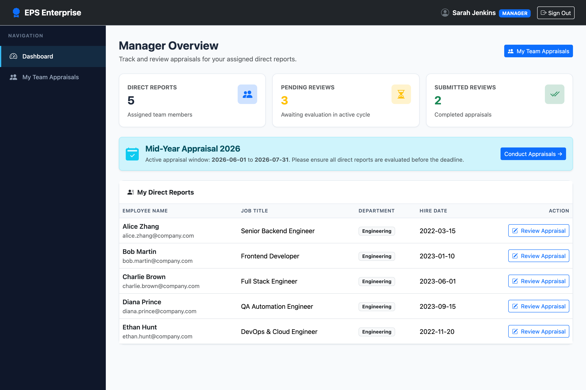
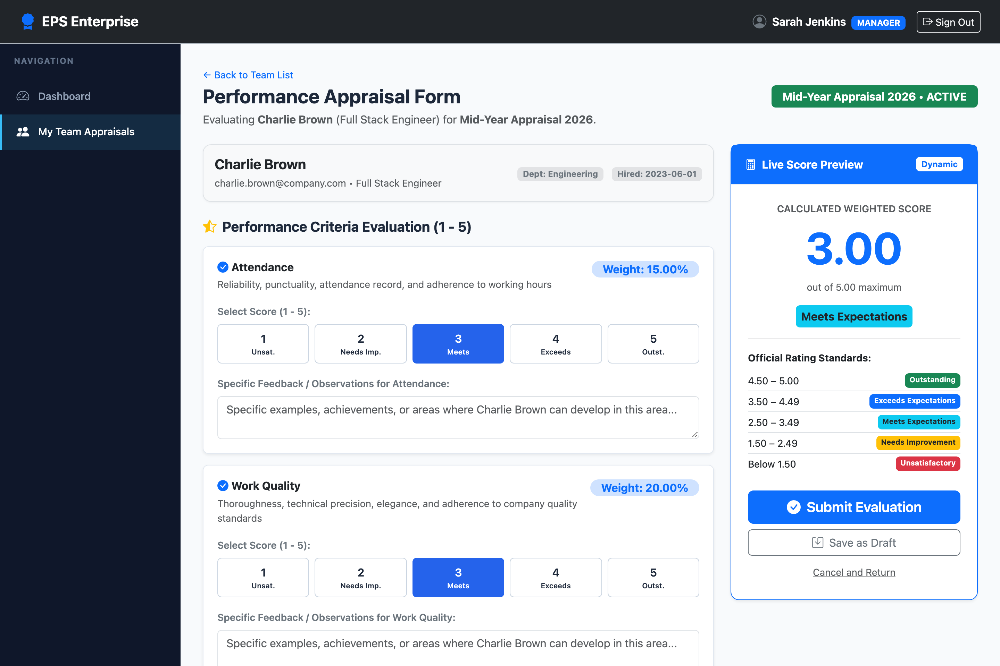
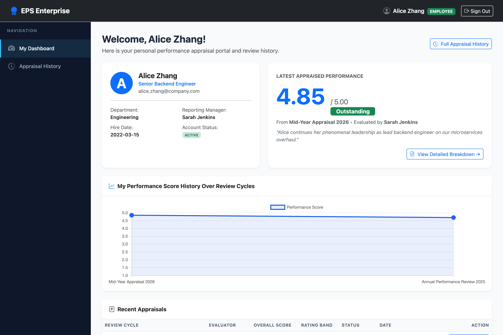
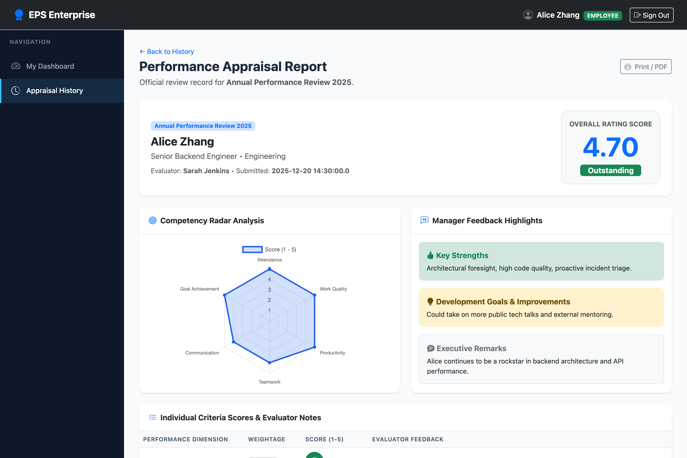
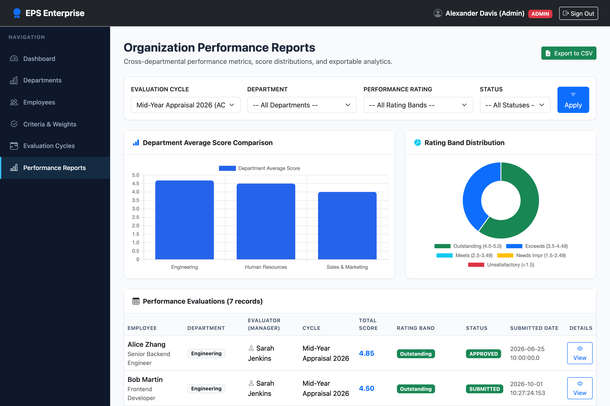

# Employee Performance Management System (EPS)

Enterprise-grade Employee Performance Management & Appraisal System built with **Java 17**, **Maven**, **Jakarta Servlets (Tomcat 10+)**, **JSP & JSTL**, **MySQL 8**, **JDBC**, **Bootstrap 5**, and **Chart.js**. The application strictly implements the **Model-View-Controller (MVC)** architectural pattern with **zero Spring Boot dependencies**.

---

## 🌟 Key Features

### 🛡️ Role-Based Access & Security
- **Secure Authentication**: Salted **BCrypt** password hashing (cost factor 12).
- **Session Management**: Secure session validation with cache-prevention headers.
- **Filter-Based Security**: Declarative `AuthenticationFilter` and `RoleAuthorizationFilter` enforcing strict boundaries for `/admin/*`, `/manager/*`, and `/employee/*`.
- **Demo Quick Access**: One-click demo credential fill on the sign-in screen.

### 👑 Administrator Features
- **Organization Dashboard**: KPI summary cards (Headcount, Active Cycle, Completed Appraisals, Company Average Score), Department chart, and quick shortcuts.
- **Departments Management (CRUD)**: Create, edit, and delete departments with safety checks preventing deletion of populated departments.
- **Employees Management (CRUD)**: Register staff with user account generation, edit employee profiles, assign reporting supervisors, and delete staff.
- **Criteria & Weightage Configuration**: Configure appraisal criteria and relative weightages (Attendance, Work Quality, Productivity, Teamwork, Communication, Goal Achievement) with visual 100% total progress tracker.
- **Evaluation Cycles Lifecycle**: Manage appraisal cycles (Start date, End date, Description) and state transitions (`DRAFT` $\to$ `ACTIVE` $\to$ `COMPLETED`).
- **Organization Performance Reports**:
  - Filter by Cycle, Department, Rating category, and Status.
  - Interactive **Chart.js Bar Chart** (Department average scores).
  - Interactive **Chart.js Doughnut Chart** (Rating band distribution).
  - **CSV Export**: Streamed directly via HTTP with proper attachment headers.

### 👔 Manager Features
- **Manager Dashboard**: Overview of direct reports, pending appraisal counts, completed counts, and active cycle alerts.
- **Team Appraisal Roster**: Track review status per team member (`Submitted`, `Draft Saved`, `Not Started`).
- **Performance Appraisal Form**:
  - 1–5 scoring across all 6 core criteria with specific comment fields.
  - **Live Score Calculator**: Real-time weighted score preview and rating badge updater as scores are selected.
  - Qualitative assessments: Key Strengths, Areas for Improvement, and Overall Summary Feedback.
  - Flexible workflow: **Save as Draft** or **Submit Final Evaluation**.
- **Appraisal Review View**: Clean, printable summary record of submitted evaluations.

### 👤 Employee Features
- **Self-Service Dashboard**: Personal profile, latest appraisal rating badge, and overall score card.
- **Performance Score History**: Interactive line chart tracking performance scores across past appraisal cycles.
- **Appraisal History**: Complete archive of all past appraisals.
- **Detailed Appraisal Breakdown**:
  - Individual criterion scores (1–5), weights, and manager feedback.
  - **Chart.js Competency Radar Chart** mapping strengths across the 6 dimensions.
  - Manager's guidance on development goals and strengths.
  - Print / PDF export friendly view.

---

## 📐 Scoring Formula & Official Rating Scale

Appraisals are scored on a scale of **1.00 to 5.00** using the weighted formula:

$$\text{Total Score} = \frac{\sum_{i=1}^{n} (\text{Score}_i \times \text{Weight}_i)}{\sum_{i=1}^{n} \text{Weight}_i}$$

### Official Rating Categories:
| Score Range | Performance Rating | Badge Style |
| :--- | :--- | :--- |
| **4.50 – 5.00** | **Outstanding** | `bg-success` (Green) |
| **3.50 – 4.49** | **Exceeds Expectations** | `bg-primary` (Blue) |
| **2.50 – 3.49** | **Meets Expectations** | `bg-info` (Cyan) |
| **1.50 – 2.49** | **Needs Improvement** | `bg-warning` (Yellow) |
| **Below 1.50** | **Unsatisfactory** | `bg-danger` (Red) |

### Default Criteria & Weights:
1. **Attendance & Punctuality**: 15.00%
2. **Work Quality & Accuracy**: 20.00%
3. **Productivity & Timeliness**: 20.00%
4. **Teamwork & Collaboration**: 15.00%
5. **Communication Skills**: 15.00%
6. **Goal Achievement**: 15.00%
*(Total Sum = 100.00%)*

---

## 🔑 Demo User Credentials

All sample accounts are preloaded with BCrypt hashed passwords:

| Role | Username | Email | Password | Assigned Department / Notes |
| :--- | :--- | :--- | :--- | :--- |
| **Admin** | `admin` | `admin@company.com` | `Admin@123` | System Administrator |
| **Manager 1** | `manager1` | `manager1@company.com` | `Manager@123` | Engineering Manager (Sarah Jenkins) |
| **Manager 2** | `manager2` | `manager2@company.com` | `Manager@123` | Sales & Marketing Manager (David Miller) |
| **Employee 1** | `emp1` | `alice.zhang@company.com` | `Employee@123` | Senior Backend Engineer (Reports to Manager 1) |
| **Employee 2** | `emp2` | `bob.martin@company.com` | `Employee@123` | Frontend Developer (Reports to Manager 1) |
| **Employee 3** | `emp3` | `charlie.brown@company.com` | `Employee@123` | Full Stack Engineer (Reports to Manager 1) |
| **Employee 4** | `emp4` | `diana.prince@company.com` | `Employee@123` | QA Automation Engineer (Reports to Manager 1) |
| **Employee 5** | `emp5` | `ethan.hunt@company.com` | `Employee@123` | DevOps & Cloud Engineer (Reports to Manager 1) |
| **Employee 6** | `emp6` | `fiona.gallagher@company.com` | `Employee@123` | Account Executive (Reports to Manager 2) |
| **Employee 7** | `emp7` | `george.clark@company.com` | `Employee@123` | Digital Marketing Specialist (Reports to Manager 2) |
| **Employee 8** | `emp8` | `hannah.abbott@company.com` | `Employee@123` | Sales Development Rep (Reports to Manager 2) |
| **Employee 9** | `emp9` | `ian.malcolm@company.com` | `Employee@123` | Content Strategist (Reports to Manager 2) |
| **Employee 10** | `emp10` | `julia.roberts@company.com` | `Employee@123` | HR Generalist (Reports to Manager 2) |

---

## 🏗️ Project Architecture

```
EMPLOYEE PERFORMANCE MANAGEMENT SYSTEM/
├── pom.xml                               # Maven project configuration
├── mvnw                                  # Maven project wrapper
├── database/
│   ├── schema.sql                        # MySQL 8 schema script
│   └── sample-data.sql                   # Realistic seed data script
├── src/main/resources/
│   ├── db.properties.example             # Configuration template
│   └── db.properties                     # Runtime database credentials
├── src/main/java/com/eps/
│   ├── controller/                       # Jakarta Servlets (MVC Controllers)
│   │   ├── HomeController.java           # Root redirection
│   │   ├── AuthController.java           # Login / Logout
│   │   ├── AdminController.java          # Admin operations & CSV export
│   │   ├── ManagerController.java        # Manager team & appraisal forms
│   │   └── EmployeeController.java       # Employee history & radar charts
│   ├── model/                            # Domain Entities (OOP)
│   │   ├── User.java                     # Abstract base User
│   │   ├── Admin.java                    # Inherits User
│   │   ├── Manager.java                  # Inherits User
│   │   ├── Employee.java                 # Inherits User
│   │   ├── Department.java               # Department entity
│   │   ├── EvaluationCycle.java          # Appraisal cycle entity
│   │   ├── EvaluationCriterion.java      # Criteria dimensions
│   │   ├── Evaluation.java               # Evaluation appraisal header
│   │   ├── EvaluationScore.java          # Criterion score item
│   │   ├── DepartmentStats.java          # Report aggregation model
│   │   ├── ReportFilter.java             # Report query parameters
│   │   └── RatingScale.java              # Performance bands enum
│   ├── dao/                              # Data Access Object Interfaces
│   │   ├── GenericDAO.java               # Generic DAO pattern
│   │   ├── UserDAO.java
│   │   ├── DepartmentDAO.java
│   │   ├── EmployeeDAO.java
│   │   ├── EvaluationCycleDAO.java
│   │   ├── EvaluationCriterionDAO.java
│   │   └── EvaluationDAO.java
│   ├── dao/impl/                         # JDBC DAO Implementations
│   │   ├── UserDAOImpl.java
│   │   ├── DepartmentDAOImpl.java
│   │   ├── EmployeeDAOImpl.java
│   │   ├── EvaluationCycleDAOImpl.java
│   │   ├── EvaluationCriterionDAOImpl.java
│   │   └── EvaluationDAOImpl.java
│   ├── service/                          # Business Service Interfaces
│   │   ├── AuthService.java
│   │   ├── DepartmentService.java
│   │   ├── EmployeeService.java
│   │   ├── EvaluationCycleService.java
│   │   ├── EvaluationCriterionService.java
│   │   ├── EvaluationService.java
│   │   └── ReportService.java
│   ├── service/impl/                     # Business Service Implementations
│   │   ├── AuthServiceImpl.java
│   │   ├── DepartmentServiceImpl.java
│   │   ├── EmployeeServiceImpl.java
│   │   ├── EvaluationCycleServiceImpl.java
│   │   ├── EvaluationCriterionServiceImpl.java
│   │   ├── EvaluationServiceImpl.java
│   │   └── ReportServiceImpl.java
│   ├── util/                             # Helper & Persistence Utilities
│   │   ├── DBConnectionManager.java      # Dual-mode JDBC pool / Fallback
│   │   ├── PasswordUtil.java             # BCrypt hashing & verifying
│   │   ├── ScoreCalculator.java          # Weighted scoring formula
│   │   ├── CSVExporter.java              # RFC-4180 CSV streaming
│   │   ├── DateUtil.java
│   │   └── ValidationUtil.java
│   ├── filter/                           # Servlet Filters
│   │   ├── EncodingFilter.java           # UTF-8 encoding
│   │   ├── AuthenticationFilter.java     # Session verification
│   │   └── RoleAuthorizationFilter.java  # Role permission boundaries
│   └── exception/                        # Custom Exception Hierarchy
│       ├── AppException.java
│       ├── AuthenticationException.java
│       ├── UnauthorizedAccessException.java
│       ├── ValidationException.java
│       ├── ResourceNotFoundException.java
│       └── DatabaseException.java
├── src/main/webapp/
│   ├── WEB-INF/
│   │   ├── web.xml                       # Jakarta EE 10 web descriptor
│   │   └── views/
│   │       ├── auth/login.jsp
│   │       ├── admin/dashboard.jsp, departments.jsp, employees.jsp, criteria.jsp, cycles.jsp, reports.jsp
│   │       ├── manager/dashboard.jsp, team.jsp, evaluate.jsp, evaluation-view.jsp
│   │       ├── employee/dashboard.jsp, history.jsp, evaluation-details.jsp
│   │       └── common/header.jsp, navbar.jsp, sidebar.jsp, footer.jsp, alerts.jsp
│   └── assets/
│       ├── css/custom.css                # Enterprise styling
│       └── js/main.js                    # Live calculator & alerts
└── docs/
    ├── use-case-diagram.md               # Use case diagrams & specs
    ├── er-diagram.md                     # Entity-Relationship diagram & dictionary
    ├── architecture.md                   # MVC design & security design
    └── presentation-outline.md           # Slide-by-slide presentation outline
```

---

## 🚀 Setup & Execution Guide

### Prerequisites
- **Java**: Java 17 or higher
- **Maven**: Apache Maven 3.8+ (a bundled `./mvnw` script is included)
- **Tomcat**: Apache Tomcat 10+ (supporting Jakarta EE 9/10 / Servlet 6.0)
- **MySQL**: MySQL 8.0+ *(Optional for immediate local testing via built-in zero-setup mode)*

---

### Step 1: MySQL 8 Database Setup

1. Start your local MySQL 8 server:
   ```bash
   mysql.server start
   ```
2. Log into the MySQL client:
   ```bash
   mysql -u root -p
   ```
3. Execute the schema script:
   ```sql
   SOURCE database/schema.sql;
   ```
4. Execute the seed data script:
   ```sql
   SOURCE database/sample-data.sql;
   ```
5. Configure database credentials in `src/main/resources/db.properties`:
   ```properties
   db.driver=com.mysql.cj.jdbc.Driver
   db.url=jdbc:mysql://localhost:3306/eps_db?useSSL=false&allowPublicKeyRetrieval=true&serverTimezone=UTC&characterEncoding=UTF-8
   db.username=root
   db.password=your_mysql_password
   db.auto_fallback=true
   ```

> 💡 **Smart Zero-Setup Fallback**: If local MySQL 8 is offline or credentials are not yet configured, the system automatically initializes an embedded MySQL-compatible in-memory engine pre-populated with `schema.sql` and `sample-data.sql`. This allows running and verifying all features out-of-the-box without blocking!

---

### Step 2: Build the Application

Build and package the production WAR file:
```bash
./mvnw clean package
```
This generates the ready-to-deploy archive at:
```
target/eps.war
```

---

### Step 3: Deploy to Apache Tomcat 10+

1. Copy the built WAR file to your Tomcat `webapps/` directory:
   ```bash
   cp target/eps.war /path/to/tomcat/webapps/
   ```
2. Start Apache Tomcat:
   ```bash
   /path/to/tomcat/bin/catalina.sh start
   ```
3. Open your browser and navigate to:
   ```
   http://localhost:8080/eps/
   ```

---

### Step 4: Standalone / Embedded Run (Direct Workspace Testing)

You can launch the bundled Tomcat 10.1 server in the workspace with:
```bash
./tomcat/bin/catalina.sh start
```
And view logs:
```bash
tail -f ./tomcat/logs/catalina.out
```
To stop Tomcat:
```bash
./tomcat/bin/catalina.sh stop
```

---

## ☁️ Production Railway Cloud Deployment Guide

The project is fully pre-configured for automated container deployment on **[Railway](https://railway.app)** via Docker and multi-stage Maven packaging.

### Key Deployment Highlights
- **Multi-Stage Dockerfile**: Builds the WAR file with Maven 3.9 / Java 17 and runs on Apache Tomcat 10.1.
- **Dynamic Port Binding**: Automatically maps Railway's dynamic `$PORT` environment variable to Tomcat's `server.xml` HTTP connector via `docker-entrypoint.sh`.
- **Root Context Routing**: Deployed as `ROOT.war` so the application runs at the root public domain (`https://<your-app>.up.railway.app/`) with zero `/eps/` prefix required.
- **Auto-Provisioning**: On first boot against a newly created Railway MySQL database, `DBConnectionManager` automatically executes `schema.sql` and `sample-data.sql` so all sample users and appraisals are available immediately.

---

### Step 1: Provision a MySQL Database on Railway
1. Log in to [Railway](https://railway.app) and create a **New Project**.
2. Click **+ New** $\to$ **Database** $\to$ **Add MySQL**.
3. Railway will provision a managed MySQL 8 instance and expose connection variables.

---

### Step 2: Deploy the Application from GitHub
1. In your Railway project canvas, click **+ New** $\to$ **GitHub Repo**.
2. Select your repository (`EMPLOYEE PERFORMANCE MANAGEMENT SYSTEM`).
3. Railway will detect the `Dockerfile` and `railway.json` automatically.

---

### Step 3: Link Environment Variables
In your web service's **Variables** tab on Railway, link to your MySQL instance using Railway Reference Variables or explicit values:

| Environment Variable | Railway Reference Value / Example | Description |
| :--- | :--- | :--- |
| `DB_HOST` | `${{MySQL.MYSQLHOST}}` | MySQL server host address |
| `DB_PORT` | `${{MySQL.MYSQLPORT}}` | MySQL port (default 3306) |
| `DB_NAME` | `${{MySQL.MYSQLDATABASE}}` | Database name |
| `DB_USER` | `${{MySQL.MYSQLUSER}}` | Database username |
| `DB_PASSWORD` | `${{MySQL.MYSQLPASSWORD}}` | Database password |

*(Note: If you link Railway's MySQL service directly, the application will also automatically recognize Railway's native variables: `MYSQLHOST`, `MYSQLPORT`, `MYSQLDATABASE`, `MYSQLUSER`, `MYSQLPASSWORD`, and `MYSQL_URL`.)*

---

### Step 4: Generate a Public Domain
1. In your web service on Railway, navigate to **Settings** $\to$ **Networking**.
2. Click **Generate Domain** (e.g., `https://eps-enterprise-production.up.railway.app`).
3. Open the public URL in your browser:
   - Root URL `/` immediately redirects to `/auth/login`.
   - Log in using any demo account (`admin` / `Admin@123`, `manager1` / `Manager@123`, `emp1` / `Employee@123`).

---

### Step 5: (Alternative) Deploy Using Railway CLI
You can also deploy directly from your local terminal:
```bash
# Install Railway CLI
npm i -g @railway/cli

# Login and link project
railway login
railway link

# Deploy current directory
railway up
```

---

## 🧪 Testing the Application Flows

1. **Test Admin Flow**:
   - Navigate to `http://localhost:8080/eps/auth/login`.
   - Click the **Admin** demo button (`admin` / `Admin@123`).
   - Explore the Organization Dashboard, Department CRUD, Employee Directory, Criteria Weights, and Evaluation Cycles.
   - Go to **Performance Reports**, apply filters, view the charts, and click **Export to CSV**.

2. **Test Manager Flow**:
   - Sign out and click **Manager 1** demo button (`manager1` / `Manager@123`).
   - View team members in **My Team Appraisals**.
   - Click **Start Evaluation** or **Resume Draft** for an employee.
   - Adjust criterion ratings (1–5) and watch the **Live Score Preview** compute dynamically.
   - Add qualitative remarks and click **Submit Evaluation**.

3. **Test Employee Flow**:
   - Sign out and click **Employee (Alice)** demo button (`emp1` / `Employee@123`).
   - View your personal rating badge, score, and performance trend chart.
   - Click **View Details** to inspect the 6-axis **Competency Radar Chart** and supervisor feedback.

---

## 📸 Application Screenshots Gallery

All screenshots are stored in [`docs/screenshots/`](docs/screenshots/) at high resolution (1440×960 retina):

### 1. Login Page

*Modern sign-in interface featuring BCrypt password hashing, session authentication, and one-click demo credentials fill.*

### 2. Admin Dashboard

*Executive overview displaying company headcount, active appraisal cycles, completed reviews, and overall average performance scores.*

### 3. Employee Management Directory

*Comprehensive employee directory with department assignment, reporting manager hierarchy, job titles, and CRUD actions.*

### 4. Department Management

*Organization departments listing with employee counts and safe deletion validation.*

### 5. Evaluation Cycles Management

*Appraisal period management tracking active, draft, and completed review cycles.*

### 6. Manager Dashboard

*Supervisor workspace showing direct reports, pending evaluation counts, and team appraisal status.*

### 7. Employee Evaluation Form with Live Score Calculator

*Appraisal form featuring 1–5 scoring across all 6 core criteria, individual feedback, qualitative comments, and a real-time live score calculator with official rating badge updates.*

### 8. Employee Self-Service Dashboard

*Personal portal showing latest appraised performance score (4.85 Outstanding), supervisor remarks, and multi-cycle performance score trend line chart.*

### 9. Employee Evaluation Breakdown & Competency Radar Chart

*Detailed appraisal breakdown featuring the 6-dimension Chart.js Competency Radar Chart, manager feedback highlights, and development goals.*

### 10. Organization Performance Reports & Analytics

*Cross-departmental analytics with multi-parameter filtering, Department Average Comparison Bar Chart, Rating Band Doughnut Chart, and RFC-4180 CSV Export.*

---

## 📤 GitHub Upload Instructions

Follow these step-by-step commands to push this project to a new GitHub repository:

### Step 1: Initialize Git Repository
```bash
# Navigate to the project root directory
cd "EMPLOYEE PERFORMANCE MANAGEMENT SYSTEM"

# Initialize a new git repository
git init
```

### Step 2: Stage and Commit the Code
```bash
# Verify .gitignore is in place (ignores target/, tomcat/, and credentials)
git status

# Stage all project files
git add .

# Create the initial commit
git commit -m "feat: complete Employee Performance Management System (Java 17, Servlets, JSP, MySQL, Bootstrap 5, Chart.js)"
```

### Step 3: Link and Push to GitHub
```bash
# Set default branch to main
git branch -M main

# Add your GitHub repository remote URL (replace with your repo URL)
git remote add origin https://github.com/<your-username>/<your-repo-name>.git

# Push the codebase to GitHub
git push -u origin main
```

*(Alternatively, if using the GitHub CLI `gh`:)*
```bash
gh repo create employee-performance-system --public --source=. --remote=origin --push
```
