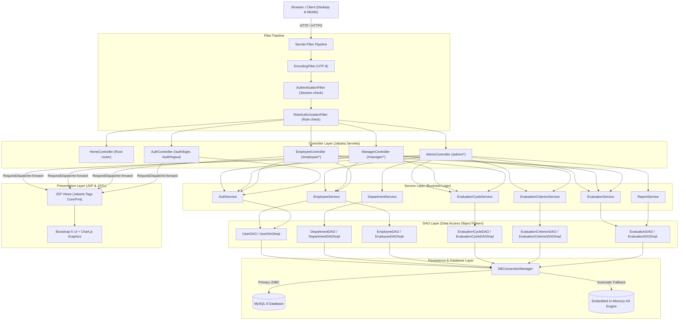

# Architecture & Technical Design Document

## 1. Architectural Style & Design Principles
The **Employee Performance Management System (EPS)** is engineered using the classic **Model-View-Controller (MVC)** architectural pattern on **Java 17** and **Jakarta EE 10 (Tomcat 10+)** without Spring Boot dependencies.

---

## 2. Object-Oriented Programming (OOP) Demonstration

### 2.1. Abstraction & Inheritance
- Base class [`com.eps.model.User`](file:///Users/adityasingh/Downloads/EMPLOYEE%20PERFORMANCE%20MANAGEMENT%20SYSTEM/src/main/java/com/eps/model/User.java) defines common user attributes (`id`, `username`, `passwordHash`, `role`, `fullName`, `email`, `phone`, `status`).
- Abstract methods:
  - `public abstract String getRoleDisplayName();`
  - `public abstract String getDefaultDashboardUrl();`
- Specialized subclasses inherit and customize behavior:
  - [`Admin`](file:///Users/adityasingh/Downloads/EMPLOYEE%20PERFORMANCE%20MANAGEMENT%20SYSTEM/src/main/java/com/eps/model/Admin.java): Admin capabilities and dashboard routing.
  - [`Manager`](file:///Users/adityasingh/Downloads/EMPLOYEE%20PERFORMANCE%20MANAGEMENT%20SYSTEM/src/main/java/com/eps/model/Manager.java): Holds direct reports and evaluator role.
  - [`Employee`](file:///Users/adityasingh/Downloads/EMPLOYEE%20PERFORMANCE%20MANAGEMENT%20SYSTEM/src/main/java/com/eps/model/Employee.java): Extends `User` with department, job title, manager reference, hire date, and salary.

### 2.2. Polymorphism
- `UserDAOImpl` inspects the `role` column in the database and polymorphically instantiates `Admin`, `Manager`, or `Employee`.
- Controllers and Filters invoke polymorphic methods like `user.getDefaultDashboardUrl()` to redirect users without hardcoding role-switch logic.

### 2.3. Encapsulation
- All domain entity fields are strictly `private`.
- Invariants and business calculations are encapsulated within domain methods:
  - `Evaluation.calculateTotalScore()` calculates weighted sum and automatically derives rating band.
  - `EvaluationScore.getWeightedScore()` calculates criterion contribution.
  - `EvaluationCycle.isActive()`, `EvaluationCycle.isCompleted()`.

### 2.4. Generics and Collections
- [`GenericDAO<T, ID>`](file:///Users/adityasingh/Downloads/EMPLOYEE%20PERFORMANCE%20MANAGEMENT%20SYSTEM/src/main/java/com/eps/dao/GenericDAO.java) uses type parameters `<T, ID>` for type-safe CRUD operations.
- Extensive use of `List<T>`, `Map<K, V>`, and Java Streams for criterion mapping and statistic aggregations.

### 2.5. Custom Exceptions
Structured exception hierarchy in `com.eps.exception`:
- `AppException` (Root custom exception)
- `AuthenticationException` (Invalid credentials, disabled accounts)
- `UnauthorizedAccessException` (Role privilege violations)
- `ValidationException` (Validation violations, weight sums, score limits)
- `ResourceNotFoundException` (Missing entities)
- `DatabaseException` (JDBC / connection failures)

### 2.6. DAO Pattern & PreparedStatement Security
- Complete separation of persistence logic into DAO interfaces and JDBC implementations.
- **100% of SQL queries use `PreparedStatement` with parameterized placeholders (`?`)** to eliminate SQL injection vulnerabilities.
- Standard `try-with-resources` ensures deterministic resource closure (`Connection`, `PreparedStatement`, `ResultSet`).

---

## 3. Scoring & Rating Calculation Engine

Evaluation ratings are computed via the formula:

$$\text{Total Score} = \frac{\sum_{i=1}^{n} (\text{Score}_i \times \text{Weight}_i)}{\sum_{i=1}^{n} \text{Weight}_i}$$

### Rating Scale Mapping:
| Score Band | Rating Label | Badge Color | Meaning |
| :--- | :--- | :--- | :--- |
| **4.50 – 5.00** | **Outstanding** | Green (`bg-success`) | Exceptional performance exceeding all goals |
| **3.50 – 4.49** | **Exceeds Expectations** | Blue (`bg-primary`) | Consistently high quality and deliverables |
| **2.50 – 3.49** | **Meets Expectations** | Cyan (`bg-info`) | Thorough execution meeting expected job standards |
| **1.50 – 2.49** | **Needs Improvement** | Yellow (`bg-warning`) | Performance fell below required goals |
| **Below 1.50** | **Unsatisfactory** | Red (`bg-danger`) | Critical performance deficiencies |

---

## 4. Security Architecture

1. **Password Hashing**: Passwords hashed using industry-standard **BCrypt** with work factor 12 via `at.favre.lib:bcrypt`.
2. **Session Authentication**: State stored in `HttpSession`. Unauthenticated access to protected routes (`/admin/*`, `/manager/*`, `/employee/*`) is intercepted and redirected to `/auth/login`.
3. **Role-Based Authorization**: `RoleAuthorizationFilter` verifies that `currentUser.getRole()` has authority for the requested URI prefix.
4. **Cache Prevention**: `Cache-Control: no-cache, no-store, must-revalidate` and `Pragma: no-cache` are set on all protected endpoints to prevent back-button browser caching of appraisal data after sign-out.
