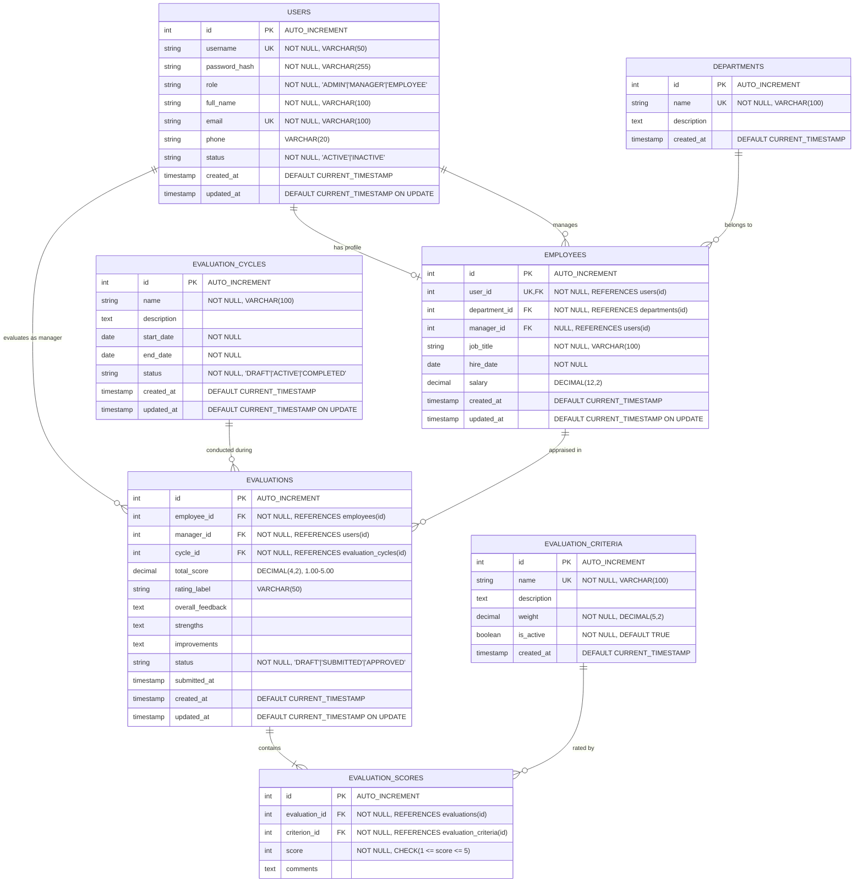

# Entity-Relationship (ER) Documentation & Diagram

## 1. Overview
The database schema for the **Employee Performance Management System** is designed in Third Normal Form (3NF) for **MySQL 8** (InnoDB engine), ensuring referential integrity, cascading updates/deletes where appropriate, and index optimization for analytical reporting.

---

## 2. Entity-Relationship Diagram

---

## 3. Data Dictionary

### 3.1. `users` Table
- Stores base authentication credentials, personal contact info, and role assignment.
- Roles: `ADMIN`, `MANAGER`, `EMPLOYEE`.
- Passwords stored as 60-character salted BCrypt hashes.

### 3.2. `departments` Table
- Organizational divisions (e.g., Engineering, Sales & Marketing, Human Resources).
- Restricts deletion if employees are currently assigned to the department.

### 3.3. `employees` Table
- Extends a user account with employment specifics: job title, hire date, salary, department FK, and manager FK.
- `user_id` has a 1-to-1 unique relationship with `users(id)` and cascades on delete.

### 3.4. `evaluation_cycles` Table
- Manages performance evaluation timelines.
- Status values:
  - `DRAFT`: Cycle is created but not yet open for manager submissions.
  - `ACTIVE`: Open for managers to score and submit appraisals.
  - `COMPLETED`: Cycle closed; archived for reporting and history viewing.

### 3.5. `evaluation_criteria` Table
- Stores appraisal assessment criteria and percentage weightage:
  1. Attendance (15%)
  2. Work Quality (20%)
  3. Productivity (20%)
  4. Teamwork (15%)
  5. Communication (15%)
  6. Goal Achievement (15%)
  Sum = 100%.

### 3.6. `evaluations` Table
- Master appraisal record for an employee in a given evaluation cycle.
- Enforces unique constraint `(employee_id, cycle_id)` so an employee receives one evaluation per cycle.
- `total_score` and `rating_label` are calculated based on weighted criteria scores.

### 3.7. `evaluation_scores` Table
- Individual score (1–5) and feedback comments for each criterion in an evaluation.
- Enforces unique constraint `(evaluation_id, criterion_id)`.
