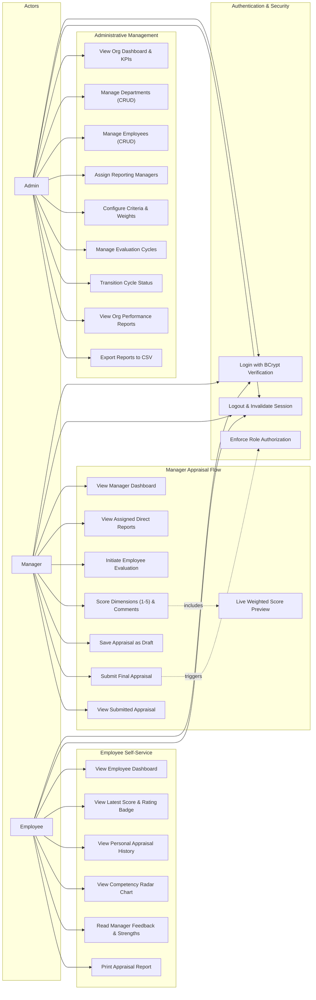

# Use Case Documentation & Diagram

## 1. Overview
The **Employee Performance Management System (EPS)** is an enterprise web application designed to facilitate end-to-end performance appraisals. The system defines three primary human actors: **System Administrator**, **Manager / Lead Evaluator**, and **Employee**, as well as automated system services.

---

## 2. Actors & Responsibilities

| Actor | Description | Key Responsibilities |
| :--- | :--- | :--- |
| **Admin** | System administrator with full privileges | Manages departments, employees, criteria weightages, appraisal cycles, and company-wide performance reports. |
| **Manager** | People manager / supervisor | Reviews assigned direct reports, scores competencies (1–5), records qualitative feedback, saves drafts, and submits final evaluations. |
| **Employee** | Staff member being evaluated | Views personal dashboard, appraisal history across review cycles, detailed criteria scores, competency radar charts, and manager development recommendations. |
| **System** | Background authentication and calculation service | Enforces session security, verifies BCrypt hashes, calculates weighted scores, maps rating categories, and generates CSV exports. |

---

## 3. Use Case Diagram

---

## 4. Key Use Case Descriptions

### UC-01: Authenticate User
- **Actor**: Admin, Manager, Employee
- **Precondition**: User is registered with status `ACTIVE`.
- **Main Flow**:
  1. User submits username/email and plain-text password.
  2. Filter permits unauthenticated access to `/auth/login`.
  3. `AuthService` queries user by username or email.
  4. Password is verified using BCrypt hash check.
  5. Upon success, HTTP session is initialized and populated with `currentUser`.
  6. User is redirected to their polymorphic role dashboard.
- **Exceptions**: Invalid credentials or inactive account displays appropriate flash error message.

### UC-02: Conduct Performance Evaluation
- **Actor**: Manager
- **Precondition**: An evaluation cycle is in `ACTIVE` status and employee reports to manager.
- **Main Flow**:
  1. Manager selects employee from team list.
  2. System loads the 6 configured criteria: Attendance, Work Quality, Productivity, Teamwork, Communication, Goal Achievement.
  3. Manager selects a 1–5 score for each dimension and enters comments.
  4. System computes real-time preview of weighted score:
     $$\text{Total Score} = \frac{\sum (\text{Score}_i \times \text{Weight}_i)}{\sum \text{Weight}_i}$$
  5. Manager enters overall qualitative feedback, strengths, and development areas.
  6. Manager chooses "Save as Draft" or "Submit Final Evaluation".
  7. Final submission updates evaluation status to `SUBMITTED`, sets `submitted_at`, and records rating category.
